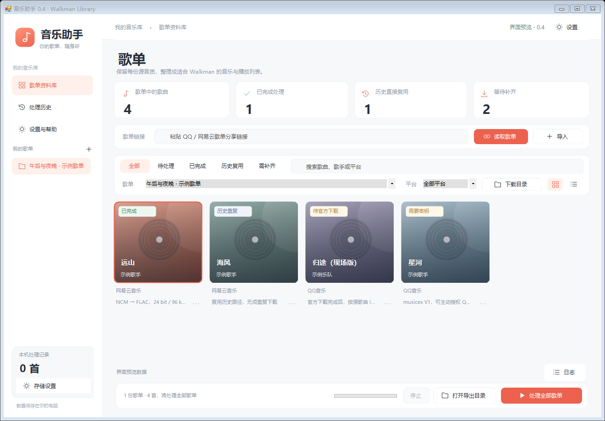

# 音乐助手

面向 Windows 10/11 x64 的个人音乐整理工具，为 Sony NW-WM1ZM2（金砖二代）准备音乐文件和播放列表。当前版本 0.5。

0.5 修复网易网页只返回部分曲目导致无法导入的问题：从公开详情获取 `trackIds`，按 100 个 ID 分批补齐歌曲信息，再按原歌单顺序组装。分享追踪参数不会写入持久歌单链接。平台总数、公开 ID 数量或可见详情不一致时，保留并显示缺口；已知 ID 的不可见歌曲保留原位置供官方客户端确认，不伪造未知 ID。

本仓库包含源码、构建脚本、模板、测试与第三方许可证，不包含真实歌曲、登录信息、单文件密钥或本地处理历史。



## 从源码构建

在 Windows 10/11 x64 的 PowerShell 中执行：

```powershell
git clone https://github.com/wjh183322/music-assistant.git
cd music-assistant
.\setup-audio.ps1
.\build.ps1
.\package.ps1
```

需要 .NET Framework 4.8 或更新版本，无须 .NET SDK。音频组件由脚本从对应项目发布页下载并校验。构建后运行 `dist/MusicAssistant.exe`，便携包生成于 `release`。编译产物没有提交到 Git 历史。

## 0.4 界面

参考 [CangXia（藏匣）](https://github.com/wjh183322/cangxia) 的白色侧栏、珊瑚色强调、浅灰工作区和卡片布局重新设计。音乐助手的图标、控件与唱片占位封面由本项目绘制，不使用藏匣的媒体或品牌资源。

- 歌单侧栏可以直接切换，右键可重命名、保存或移除任务。
- 歌曲支持专辑卡片和列表两种视图；搜索与平台、处理状态筛选可以组合使用。
- 右键歌曲或点击卡片右下角菜单，可以关联本地文件、打开官方歌曲页、补密钥或重新处理。
- 右上角设置入口集中管理导出目录、原文件回收和下载目录。
- 底部保留全部歌单处理、停止、导出目录与日志入口。登录状态获取仍需明确确认，不会因换界面自动执行。

## 启动

双击 `dist/MusicAssistant.exe`。交付目录已经包含 FFmpeg 和 FFprobe，不需要安装 Python、Node 或 .NET SDK。Windows 需有 .NET Framework 4.8 或更新版本。

发布压缩包解压后，双击其中的 `MusicAssistant.exe`，保留旁边的 `tools` 文件夹。

## 使用流程

1. 导入 CSV、TSV、JSON 或 M3U 歌单，也可以直接导入明确指定的本地音乐目录/文件。
2. 公开分享链接读取原始歌曲 ID 与顺序。已实测网易云公开歌单和 QQ 官方公开元数据服务；返回数量不完整时拒绝把部分列表当作完整歌单。
3. 点击“选择下载目录”明确指定客户端的下载文件目录。软件按 NCM / musicex / QTag 中的歌曲 ID 自动关联；同 ID 存在多份候选时由你选择。缺失歌曲通过官方客户端下载，不按歌名替换版本。
4. 在“设置与帮助”选择导出位置。默认在用户音乐目录的“音乐助手导出”。默认启用成功后回收原音乐文件，配套歌词/封面源文件保留。
5. 开始处理全部歌单。软件先恢复专属封装中的原始音频载荷，再检查编码兼容性、完整解码音频、采样率、位深、声道，并保存标签、封面、歌词及源文件信息。
6. 新版 QQ 文件如果显示“需要密钥”，右键歌曲选择“提供单文件解码密钥”，或选择“QQ 客户端补齐本歌单密钥”。后者会列明当前歌单需请求的文件数量，在你确认后使用本机已登录 QQ 音乐状态向 QQ 官方服务请求这些文件的密钥，默认不运行此操作。
7. 将导出的 `Music` 内的 `Library` 和 `Playlists` 合并复制到播放器的 `Music` 目录。不要仅复制播放列表，不要移动或重命名 `Library` 中的歌曲。
8. 可以删除电脑上的导出音乐。成功历史独立保存，默认位于 `%LOCALAPPDATA%/MusicAssistant`。默认目录不可写时改用 Roaming、LocalLow 或程序旁的 `UserData`；启动日志及“处理历史 → 打开记录目录”显示实际位置。后续启动保留已使用的数据目录，不会因权限恢复而切到空白历史。

0.3 修复启动时数据目录拒绝访问导致直接退出的问题。每次启动实际检查创建、写入、替换、读取和删除临时文件；需要切换目录时保留可读的旧记录，不清空损坏的历史。无须为这个目录问题以管理员身份运行程序。

## 当前可用与限制

- 普通 MP3、FLAC、WAV、ALAC/M4A、AIFF、AAC、WMA、DSD 按探测出的参数检查兼容性，兼容文件优先原样复制。APE、WavPack 的可保真 16/24 位音频可转为 FLAC。
- 可选将 16/24 位无损 PCM、ALAC 等整理为 FLAC；32 位 WAV/AIFF 保留原格式，不降位深。DSD 保留原字节，不转 PCM。多声道、超过规格或无法验证的音频跳过。
- 已实现 NCM、旧 QMC 静态流、QMC2 Map / RC4、QTag / STag、EncV2 ekey、musicex V1。本地恢复载荷后才交给 FFmpeg，不依赖在线解锁网站，不上传音频文件。
- NCM 的原歌曲 ID、标题、歌手、专辑、封面恢复并写入目标文件，完整容器元信息另存。解码器用合成加密音频及上游独立固定向量验证，尚未收到你的真实客户端下载文件。
- QMC2 文件内存在密钥时直接读取；musicex / STag 没有内嵌密钥时需要对应的 ekey。不能仅凭歌曲名称计算它，密钥不匹配时停止、保留源文件、不记成功历史。
- musicex V1 的主动密钥获取读取当前 Windows 登录会话内 QQ Music 进程及 QQ 的登录配置，只向 `https://u.y.qq.com/cgi-bin/musicu.fcg` 发送本批已下载歌曲所需请求。没有自动提权、没有跨用户进程读取。登录令牌仅驻留内存，不写入设置、历史和日志；单文件 ekey 写在源文件旁的 `.ekey`，不随音乐导出。
- 客户端密钥获取依据 QM Unlock 的公开 Windows 实现接入；本次测试只使用合成登录状态/响应，**没有读取你的真实登录状态，也没有实测你的 QQ 客户端账号接口**。客户端内部登录格式和服务变化、权限不一致时会明确失败，可改用手动 ekey。
- QQ 的公开歌单元数据读取已经实测，不发送登录信息。私密歌单/需登录内容仍用文件导入。歌曲缺失时使用官方客户端获取，没有接入绕过账号权限的下载。
- OGG / Vorbis / Opus 为适配金砖转成 32 位浮点 WAV，解码样本逐项一致校验，不再有损压缩；体积会增加。达到播放器 4 GB 单文件限制时跳过。
- 歌曲 ID 来自公开歌单、导入文件或封装标识，NCM 与 musicex 可直接自动关联，QQ 数字 ID 和 MID 可通过公开歌单的双标识对应。普通文件没有 ID 时保留手动关联入口，只有同名标签不会自动匹配。
- 网易的网页和 `tracks` 可能只含预览；完整读取优先用 `trackIds` 配合歌曲详情。公开 ID 数小于平台标示总数时，软件显示数量差异，不宣称导入完整；没有公开任何 ID 的非空歌单仍提示在官方客户端确认。
- 歌曲来源已经存在时会实际检查音频；没有本地源时，只有唯一品质的同平台歌曲 ID 历史或已保存任务的历史关联才能复用。不同品质不会静默合并。
- 跨平台只合并解码音频、参数、歌名和歌手均一致的歌曲，保存平台身份别名。重复处理不会自动回收新关联的源文件。
- 歌单采用 UTF-8 `.m3u` 和固定相对路径。Sony 手册确认识别 M3U，但本程序生成的中文路径和跨歌单引用**尚未在实际金砖设备上验证**。一个歌单及其歌曲应放在同一存储介质。
- 不读取播放器。历史复用只表示曾成功处理；播放器歌曲被删或移位后，点击“重新处理选中”并提供源文件，或从历史页面清除记录。
- 同名 `.lrc` 必须是 UTF-8 且不超过 512 KB。原歌词归档保存；没有歌词时不会自动从外部服务补全。
- 附加信息归档为 `source-info.json`；无法写入目标音频容器的标签仍保留在该归档中。
- 强制回收使用 Windows `IFileOperation/FOFX_RECYCLEONDELETE`，不调用永久删除。未验证回收支持的非固定磁盘位置保留源文件并报告。
- 外置歌曲封面随歌曲保存；内嵌 JPEG/PNG 封面复制/提取归档，并按索尼手册另存与歌曲所在文件夹同名的图片。播放器端专辑封面显示还需要实机验收。

## 导出结构

```text
音乐助手导出/
  Music/
    Library/
      歌手 - 歌名_音频标识/
        歌名.flac
        歌名.lrc
        cover.jpg
        source-info.json
    Playlists/
      歌单名称_标识.m3u
  Reports/
    歌单名称_标识.json
```

重复歌曲只存一份，播放列表各自引用同一路径。记录文件不要放在会随音乐一起删除的导出目录中。

## 歌单文件格式

CSV 示例见 `examples/歌单模板.csv`。字段可用中文或英文；推荐填歌曲 ID、平台、音质和对应本地路径，路径可以相对于 CSV。

JSON 使用 `Name`、`Link`、`Tracks`，曲目支持 `Title`、`Artist`、`Album`、`Platform`、`SongId`、`Quality`、`SourcePath`。平台填“QQ音乐”或“网易云音乐”。

在指定目录中可选用 `音乐文件完整路径.track.json` 声明身份，内容为上述单条曲目对象。仅歌曲 ID/平台精确匹配且只有一份候选时自动关联。

## 开发与验证

```powershell
.\setup-audio.ps1   # 重新下载已固定 SHA256 的音频组件
.\build.ps1         # 使用 Windows 自带 .NET Framework C# 编译器
.\dist\CoreTests.exe .test-output
```

源码在 `src`。测试仅处理 `.test-output` 下的合成音频，其中包含回收一个合成测试文件的检查；不会扫描或处理你的音乐。

历史/settings/tasks 使用 UTF-8 JSON，替换写入时保存 `.bak`。损坏历史不会静默重置。应用限制一个实例，避免同时修改记录。

## 官方参考

- Sony 音频规格：https://helpguide.sony.net/dmp/nwwm1m2/v1/en/contents/TP1000521636.html
- Sony 歌单：https://helpguide.sony.net/dmp/nwwm1m2/v1/en/contents/TP1000464578.html
- Sony 歌词：https://helpguide.sony.net/dmp/nwwm1m2/v1/en/contents/TP1000464221.html
- FFmpeg：https://ffmpeg.org/download.html
- FFmpeg Windows 构建：https://github.com/GyanD/codexffmpeg/releases/tag/9.0.2

FFmpeg 的许可证及构建来源随发布包提供于 `tools`。本应用通过独立进程调用它。

本地格式实现参考与许可证见 `THIRD_PARTY.md`、`licenses`。
